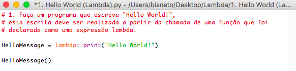
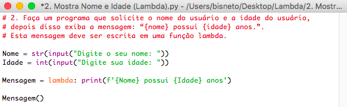
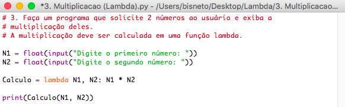
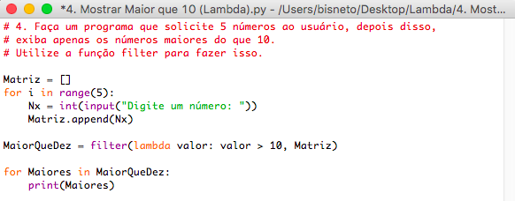
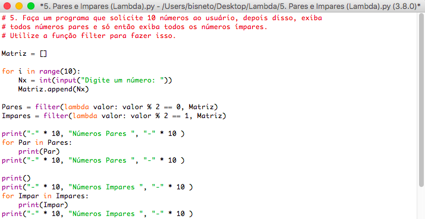
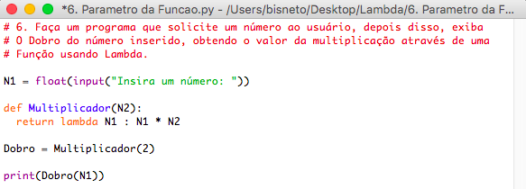

# Lambda

Repositório de exercícios Lambda em Python

## Lista de Exercícios

1. Faça um programa que escreve "Hello World!". Esta escrita deve ser realizada a partir da chamada de uma função que foi declarada como uma expressão lambda.
  

2. Faça um programa que solicite o nome do usuário e a idade do usuário, depois disso exiba a mensagem: "{nome} possui {idade} anos." Esta mensagem deve ser escrita em uma função lambda.
  

3. Faça um programa que solicite 2 números ao usuário e exiba a multiplicação deles. A multiplicação deve ser calculada em uma função lambda.
  

4. Faça um programa que solicite 5 números ao usuário, depois disso, exiba apenas os número maiores do que 10. Utilize a função filter() para isso.
  

5. Faça um programa que solicite 10 números ao usuário, depois disso, exiba todos os números pares e só então exiba os números ímpares. Utilize a função filter() para isso.
  

6. Faça um programa que solicite um número ao usuário, depois disso, exiba o dobro do número inserido, obtendo o valor da multiplicação através de uma função usando lambda.
  

#

#### Contribua com esse repositório:

- Mande seu pull-request
- Se você acha que pode ajudar alguém a aprender a linguagem, compartilha. Manda o link pro coleguinha!
- Se encontrou algum erro e puder enviar a correção, agradecerei imensamente!
- Se tiver alguma ideia, manda pra mim.
- Se tiver alguma dúvida sobre algo, pergunte.
- Contribua!

#

Copyright © 2022 Heitor Bisneto. All rights reserved.